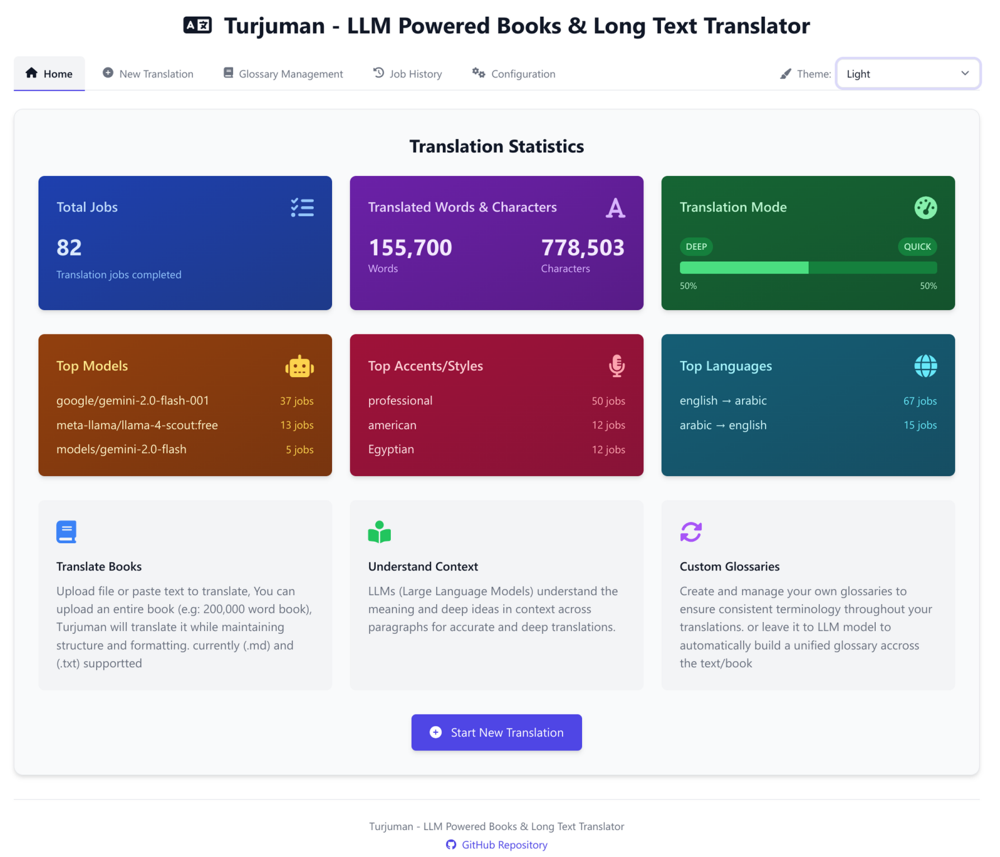
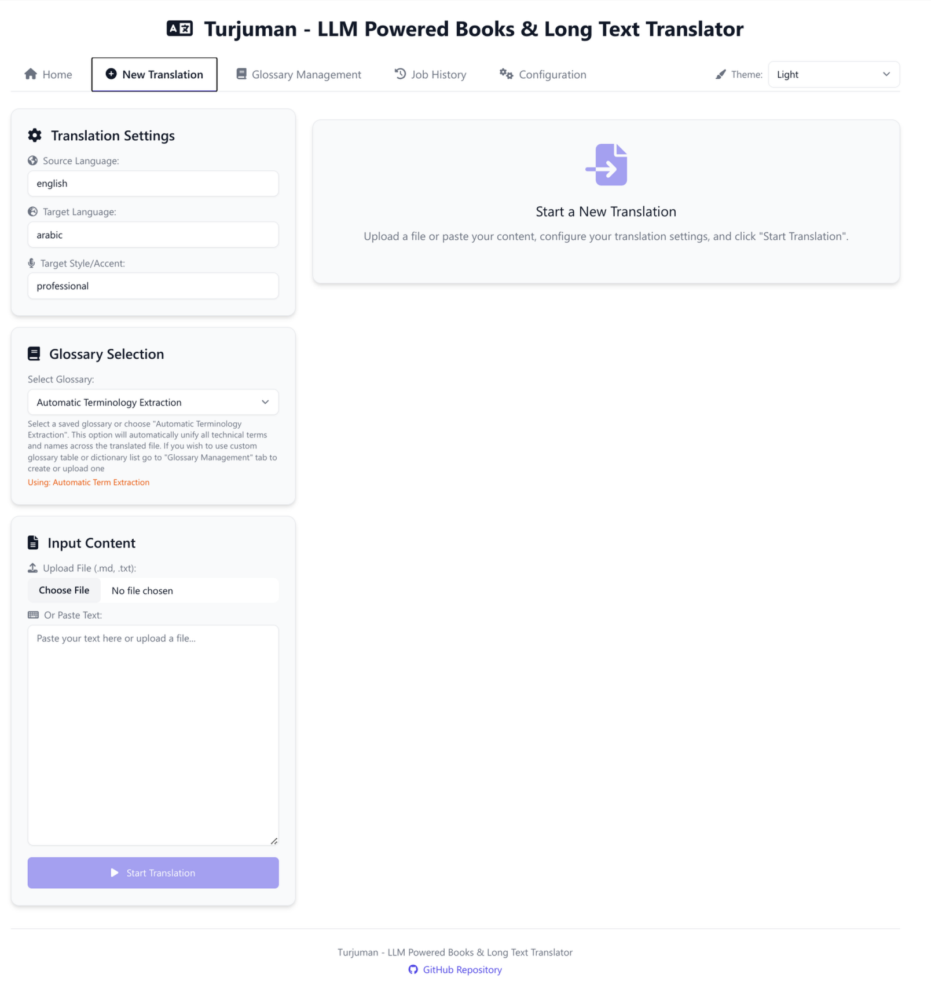
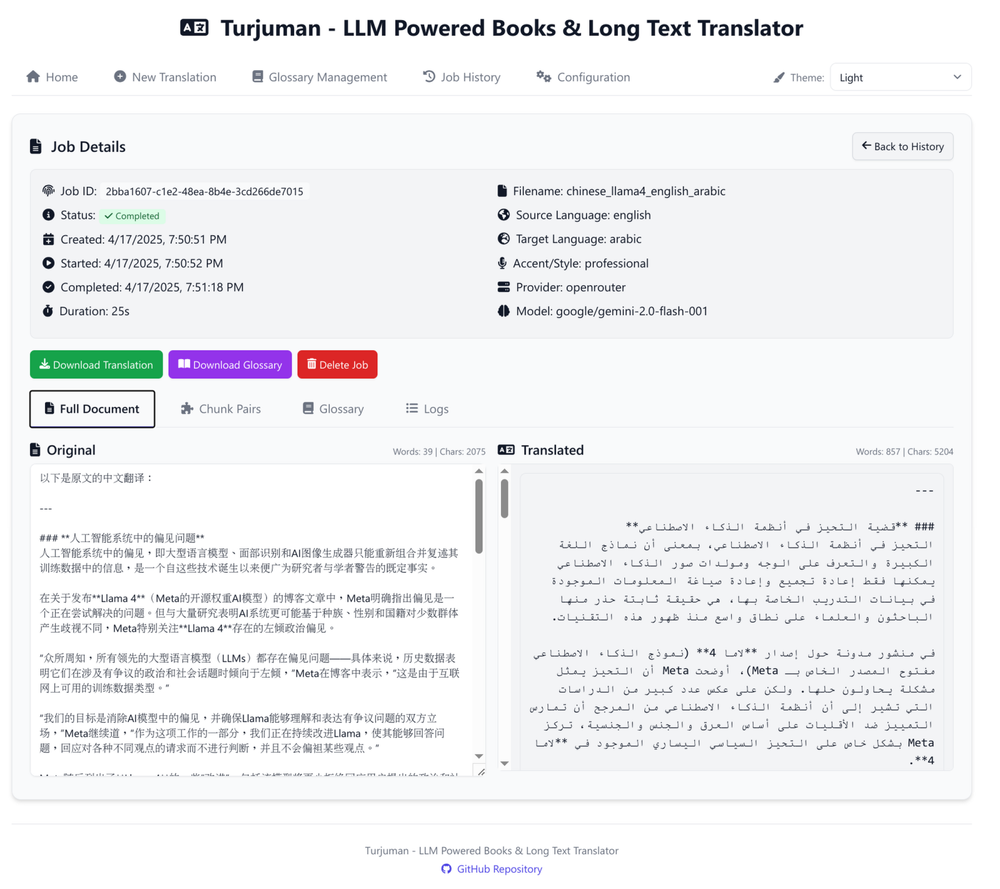
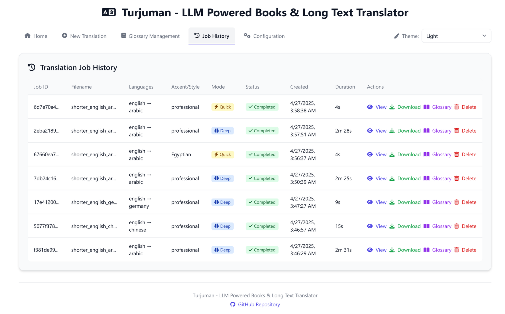
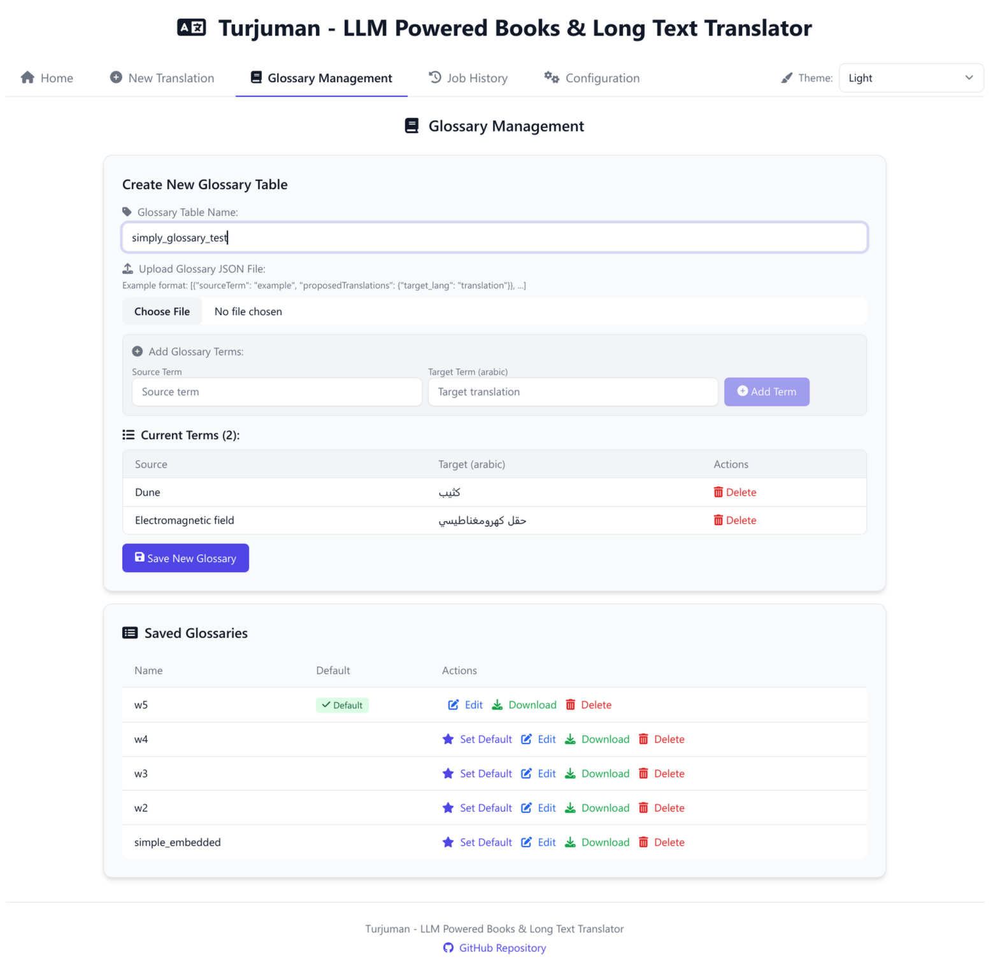
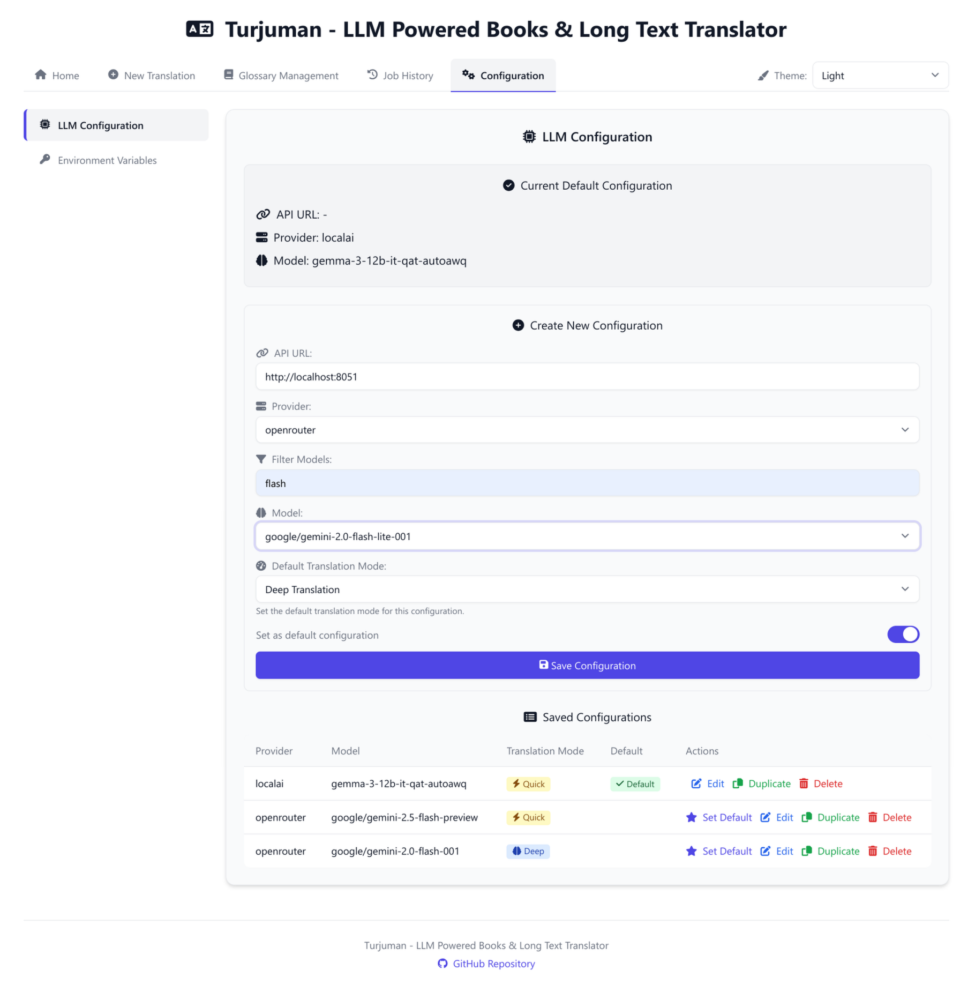

# 📖 Turjuman: Your Smart Book Translation System - Locally and privately hosted 🌍

 

Welcome to **Turjuman** (ترجمان - *Interpreter/Translator* in Arabic)! 👋

Ever felt daunted by translating a massive book (like 500 pages and over 150,000 words!)? Turjuman is here to help! (currently Markdown `.md` and plain text `.txt` files) using LLMs to magaically translate large documents while trying smartly keep the original meaning and style intact.

---

## ✨ How Turjuman Works

Turjuman uses a smart pipeline powered by LangGraph 🦜🔗 with two translation modes:

### 🔄 Translation Modes

- **🧠 Deep Translation Mode (Default)**: The comprehensive workflow with terminology unification, critique, and revision steps for higher quality and consistency. Best for professional or publication-ready translations.

- **⚡ Quick Translation Mode**: A streamlined workflow that bypasses terminology unification, critique, and revision steps for faster processing and lower token usage. Ideal for drafts or when speed is more important than perfect quality.

### 📋 Translation Pipeline

1. **🚀 init_translation**: Start the translation job
2. **🧐 terminology_unification**: Find and unify key terms, User can provide manual list of prefered glossary or dicitenary "word paires" this feature available in (Deep Mode only)
3. **✂️ chunk_document**: Split the book into chunks
4. **🌐 initial_translation**: Translate chunks in parallel
5. **🤔 critique_stage**: Review translations, catch errors (Deep Mode only)
6. **✨ final_translation**: Refine translations (Deep Mode only)
7. **📜 assemble_document**: Stitch everything back together



### 📊 Translation Flow

```mermaid
flowchart TD
    A([🚀 init_translation<br><sub>Initialize translation state and configs</sub>]) --> Mode{Translation Mode?}
    
    %% Mode decision
    Mode -->|Quick Mode| C([✂️ chunk_document<br><sub>Split the book into manageable chunks</sub>])
    Mode -->|Deep Mode| AA{User Glossary?}
    
    %% Glossary path decision (Deep Mode only)
    AA -->|Yes| AB([📘 User Glossary<br><sub>Use provided glossary terms</sub>])
    AA -->|No| AC([🔍 Auto Extract<br><sub>Extract key terms from document</sub>])
    
    %% Both glossary paths lead to terminology unification
    AB --> B([🧐 terminology_unification<br><sub>Unify glossary, prepare context</sub>])
    AC --> B
    
    B --> C

    %% Chunking produces multiple chunks
    C --> D1([📦 Chunk 1])
    C --> D2([📦 Chunk 2])
    C --> D3([📦 Chunk N])

    %% Parallel translation workers
    D1 --> E1([🌐 initial_translation<br><sub>Translate chunk 1 in parallel</sub>])
    D2 --> E2([🌐 initial_translation<br><sub>Translate chunk 2 in parallel</sub>])
    D3 --> E3([🌐 initial_translation<br><sub>Translate chunk N in parallel</sub>])

    %% Mode-based path after translation
    E1 --> ModeAfter{Translation Mode?}
    E2 --> ModeAfter
    E3 --> ModeAfter
    
    %% Quick Mode path
    ModeAfter -->|Quick Mode| I([📜 assemble_document<br><sub>Merge all chunks into final output</sub>])
    
    %% Deep Mode path
    ModeAfter -->|Deep Mode| F([🤔 critique_stage<br><sub>Review translations, check quality and consistency</sub>])

    %% Decision after critique
    F --> |No critical errors| G([✨ final_translation<br><sub>Refine translations based on feedback</sub>])
    F --> |Critical error| H([🛑 End<br><sub>Stop translation due to errors</sub>])

    G --> I
    I --> J([🏁 Done<br><sub>Translation complete!</sub>])

    H --> J
    

```

---


## 🛠️ Setup & Installation using conda or venv (for development)

1. **Prerequisites**

- **Conda**: Install [Miniconda](https://docs.conda.io/en/latest/miniconda.html) or [Anaconda](https://www.anaconda.com/products/distribution)
- **API Keys**: Get your API keys for OpenAI, Anthropic, etc.
- **Ollama**: You can use Turjuman locally without paying for LLM by installing Ollama or any Local Inference server like LMstudio, vLLM, LLamaCPP ..etc, take alook at sample.env for details


2. **Clone the Repository**

```bash
git clone <your-repo-url>
cd turjuman-book-translator
```

3. **Create Conda Environment or use python venv**

```bash
conda create -n turjuman_env python=3.12 -y
conda activate turjuman_env
```

4. **Install Dependencies**

```bash
# Install all needed libs
pip install -r requirements.txt
```

5. **Configure Environment Variables**

```bash
cp sample.env.file .env
# Edit .env and add your API keys
```
**Recommended LLM Models**
- **Online**: Gemini Flash/Pro
- **Local**: Gemma3 / Aya / Mistral 


6. **Run Backend Server**

```bash
uvicorn src.server:app --host 0.0.0.0 --port 8051 --reload
```

7. **Run the Web UI**

The application will now be accessible at [http://localhost:8051](http://localhost:8051).

---
## 🚀 Using Turjuman via integrated web UI 

visit [http://localhost:8051](http://localhost:8051)
- Go to "Configuration" tab and create a new default LLM configurations (LLM provider / model / translation mode, etc.)
- Save the configuration profile (optional: you can create multiple profiles and select one as the default)
- Select "New Translation" then upload a file to translate or paste text
- Modify the source and target language
- Modify the "Accent and style" if needed (this option can make translation more funny, spicy or professional by default)
- Start translation. After a few seconds, both logs and text chunks will update dynamically
- After translation progress reaches 100%, you can view or download the translated file or text
- You can change the theme from the top drop menu (7 themes available)
- You can switch the view between chunk or full document to review the translated content chunk by chunk




### 🔄 Job Queue & History
Turjuman includes a robust job management system:
- Track all translation jobs with detailed status information (completed, processing, pending, failed)
- View comprehensive job details including languages, duration, and timestamps
- Download completed translations directly from the history view
- Access job-specific glossaries generated during translation
- View detailed logs and progress information for each job


### 📚 Glossary Management
Create and manage custom glossaries to ensure consistent terminology:
- Build custom glossary tables with source and target term pairs
- Upload glossary files in JSON format
- Add individual terms through the user interface
- Set default glossaries for automatic use in translations
- Download, edit, and delete glossaries as needed
- Option for automatic terminology extraction during translation


### ⚙️ Configuration Management
Manage LLM settings and environment variables directly from the UI:
- Configure multiple LLM providers and models
- Select translation mode (Deep or Quick) for each configuration
- Create and save different configuration profiles
- Set default configurations for quick access
- Securely manage environment variables (API keys, etc.)
- Filter available models by keyword
- Duplicate existing configurations for easy modification



---
##  BASH Script Client

A convenient command-line client script (`translate_over_api_terminal.sh`) is provided for interacting with the backend API.

**Prerequisites:** `curl`, `jq`

**Getting Help:**

The script includes detailed usage instructions. To view them, run:

```bash
./translate_over_api_terminal.sh --help
```
or
```bash
./translate_over_api_terminal.sh -h
```

**Basic Usage:**

The only required argument is the input file (`-i` or `--input`). Other options allow you to specify languages, provider, model, API URL, and output file path.

```bash
# Translate a file using default settings (English->Arabic, OpenAI provider, default model)
# Ensure OPENAI_API_KEY is set in .env if using openai
./translate_over_api_terminal.sh -i path/to/your/document.md

# Specify languages, provider, model, and save response to a specific file
./translate_over_api_terminal.sh \
  --input my_book.md \
  --output results/my_book_translated.json \
  --source english \
  --target french \
  --provider ollama \
  --model llama3

# Use a different API endpoint
./translate_over_api_terminal.sh -i chapter1.md -u http://192.168.1.100:8051

# List available models fetched from the backend API
./translate_over_api_terminal.sh --list-models
```

The script submits the job via the API. Since the API call is synchronous, the script waits for completion and saves the full JSON response (containing the final state and the translated document in `output.final_document`) to a file (default: `<input_name>_<job_id>.json` or the path specified with `--output`). It also provides the `curl` command to retrieve the final state again using the job ID.

---
---
## 🗺️ Future Plans

- Support for PDF, DOCX, and other formats
- Further enhancements to glossary and terminology management
- Interactive editing and feedback loop
- Advanced customization options for translation styles
- Additional translation modes with different quality/speed tradeoffs
- Batch processing capabilities for multiple documents

---

## 🤝 Contributing

Pull requests welcome! For major changes, open an issue first.

---

## 📄 License

MIT

---

Enjoy translating your books with Turjuman! 🚀📚🌍